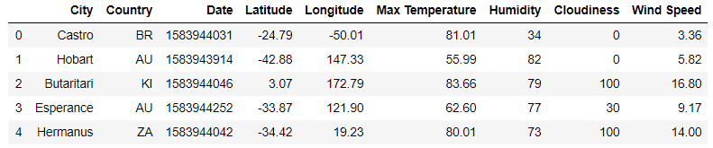
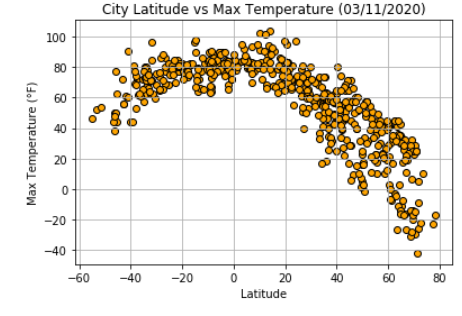
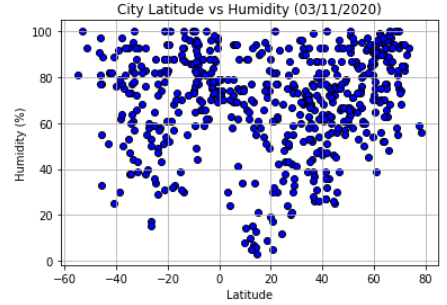
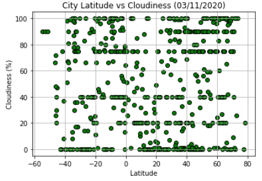
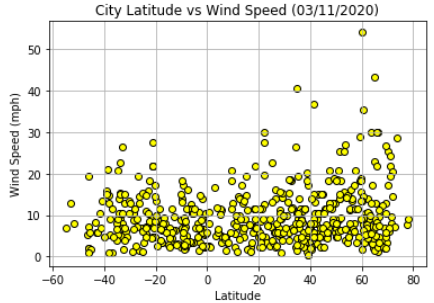

# Python API Homework - What's the Weather Like?

## Background

What's the weather like as we approach the equator? Create a Python script to visualize the weather of 500+ cities across the world of varying distance from the equator using the [CityPy Python Library](pypi.org/project/citipy/), and the [OpenWeatherMap API](openweathermap.org/api).

### Objectives

#### Covert Raw Data to DataFrame

Build Scatter Plots:

#### Temperature (F) vs Latitude

#### Humidity (%) vs Latitude

#### Cloudiness (%) vs Latitude

#### Wind Speed (mph) vs Latitude

The final notebook must:
* Randomly select **at least** 500 unique (non-repeat) cities based on latitude and longitude.
* Perform a weather check on each of the cities using a series of successive API calls.
* Include a print log of each city as it's being processed with the city number and city name.
* Save both a CSV of all data retrieved and png images for each scatter plot.

## Considerations

* The city data is generated based on random coordinates; each time the code is run you will end up with a different set of outputs
* Next, spend the requisite time necessary to study the OpenWeatherMap API. Based on your initial study, you should be able to answer basic questions about the API: Where do you request the API key? Which Weather API in particular will you need? What URL endpoints does it expect? What JSON structure does it respond with? Before a line of code is written, you should be aiming to have a crystal clear understanding of your intended outcome

## Observable Trends

* After collecting weather data randomly from 567 cities around the world using the OpenWeatherMap API, the data illustrated maximum temperature (°F), humidity (%), cloudiness (%) and wind speed (mph) with the corresponding city with respect to its Latitude. As expected, temperatures tend to be higher closer to the Equator and are significantly lower in the Northern Hemisphere at this time of the year (March 2020).It is also worth noting that temperatures peak at around 10° - 20° Latitude, and significantly drop as we approach the Southern Hemisphere. This data is inherently impacted by the changing seasons around the world and when this data was acquired and analyzed.

* There seems to be little to no correlation between humidity and latitude. Our scatter plot visualization shows a considerable amount of variance at all latitudes and points us towards no trends. However, as we approach the 60° - 80° Latitude mark, we see a spike in Humidity and a low of ~40% in this region of the world.

* Finally, wind speeds increase in the upper and lower halves of the hemisphere (around 60° to 70° Latitude).
